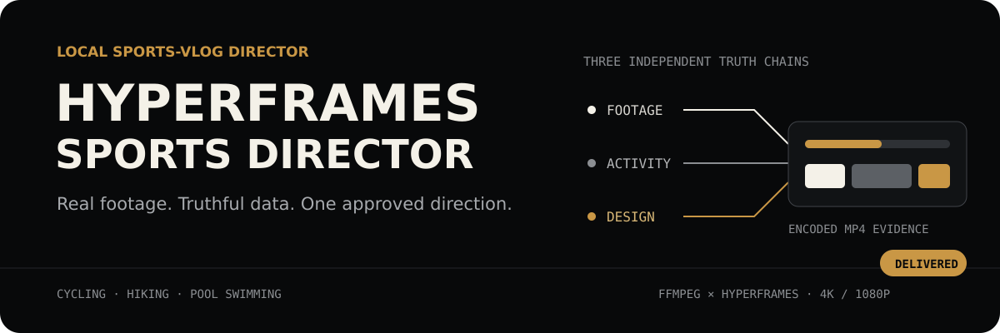

<p align="center">
  
</p>

HyperFrames Sports Director is a local Codex Skill that turns mixed sports
footage, stills, optional activity data, and local music into an immersive 16:9
Vlog. FFmpeg handles media processing; HyperFrames owns visual direction and
motion composition.

## Proven in v1

| Release evidence | Result |
| --- | --- |
| Deterministic golden evaluations | Cycling **100**, hiking **100**, pool swimming **100** |
| Delivery profiles | SDR Rec.709 MP4 at **4K** and **1080p** |
| Direction gate | One hash-bound approval, then a transactional design and Look lock |
| Final gate | Closed-file re-probe, machine checks, and Agent review of decoded MP4 evidence |

## Start with one request

```text
Use $hyperframes-sports-director to turn /path/to/ride-media into a three-minute
16:9 4K cycling Vlog. Use the local track music.m4a, keep the spoken arrival,
add English chapter titles, trim the route near home, and stay under 900 MB.
```

The input directory is read-only. Missing activity values stay `null` or
`status: "unavailable"`; generated visuals may interpret the journey but never
impersonate footage or invent metrics.

## Install

```bash
npx skills add geekjourneyx/hyperframes-sports-director
```

Restart Codex after installation. Runtime requirements are Node.js 22.12+,
local `ffmpeg` and `ffprobe`, and the filters reported by the Skill's capability
check.

## How it works

1. **Read evidence** — index originals without modifying them, then build
   review-safe proxies, probes, segments, and shot evidence.
2. **Build the story** — resolve an original-backed timeline, protect speech and
   ambience, and render a proxy rough cut.
3. **Approve direction once** — compare complete candidates in a local,
   review-safe workbench and record one `DIRECTOR_LOCK` approval.
4. **Compose with HyperFrames** — freeze semantic tokens and Look, accept a
   Style Anchor, then validate assets, motion ownership, layout, and contrast.
5. **Prove delivery** — render from hash-matching originals, inspect the encoded
   MP4, and reach `DELIVERED` only after machine and Agent gates pass.

Three truth chains remain independent throughout:

```text
PROBE → SEGMENTS → SHOTS → TIMELINE
ACTIVITY → SYNC_MAP → DATA_OVERLAYS
DESIGN_SYSTEM + LOOK_PROFILE → ASSET_MANIFEST → MOTION_MAP
```

## Profiles

| Status | Sports |
| --- | --- |
| Release-grade | Cycling, hiking/non-technical mountain journey, pool swimming |
| Experimental contracts | Running, technical mountaineering, trail running, open-water swimming |

Typical output is an approximately three-minute 16:9 MP4 at `3840x2160` or
`1920x1080`. The editing brief can set duration, required and excluded moments,
titles, captions, codec, frame-rate policy, file-size ceiling, privacy trimming,
and optional **local** background music.

## Boundaries that protect the result

- Originals, private filenames, absolute input paths, GPS, biometrics, secrets,
  proxies, and renders never enter the release package.
- Public route visuals require a genuinely trimmed derivative.
- Automatic repair stops after three attempts and cannot change approved story,
  shots, direction, colors, Look, music, privacy, or delivery.
- `DELIVERED` means the encoded file passed its gates. `USER_ACCEPTED` is an
  optional later signal and is never inferred.
- Cancellation stops child processes and removes incomplete temporary output.

Not included in v1: a GUI editor, cloud/share review, remote music or Suno,
advertising workflows, training advice, generic single-file transcoding, or
release-grade claims for experimental profiles.

## Documentation

- [Workflow and exact command pipeline](skills/hyperframes-sports-director/references/workflow.md)
- [Architecture](docs/architecture.md) and [design engineering](docs/design-engineering.md)
- [Sport profiles](skills/hyperframes-sports-director/references/sport-profiles.md)
- [Release process](RELEASING.md) and [changelog](CHANGELOG.md)
- [Upstream derivation](docs/upstream-derivation.md), [attributions](ATTRIBUTIONS.md), and [license](LICENSE)

<details>
<summary>Engineering evidence and contributor references</summary>

- [Contributor rules](AGENTS.md)
- [No-Skill baseline](docs/skill-baseline-report.md)
- [Skill evaluation](docs/skill-evaluation-report.md)
- [Design specification](docs/superpowers/specs/2026-08-31-hyperframes-sports-director-v1-design.md)
- [Implementation plan](docs/superpowers/plans/2026-08-31-hyperframes-sports-director-v1.md)

</details>

## License

[AGPL-3.0-only](LICENSE). Upstream projects remain pinned to exact commits in
[`UPSTREAM.lock.json`](UPSTREAM.lock.json).
